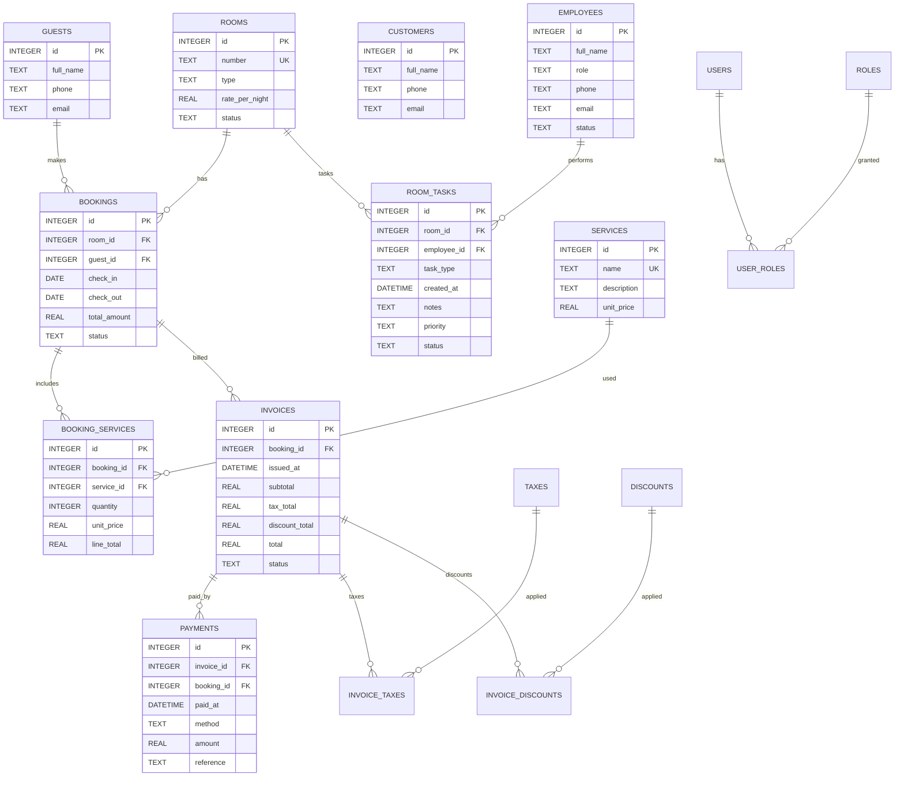

i# Hotel Management System (Java + JDBC)

A CLI-based hotel management system built with Java 17, JDBC, and MySQL. It supports operations for rooms, guests, bookings, billing, and more.

## Features
- Create/list rooms and guests
- Create/list bookings with date overlap checks
- Billing system (services, invoices, payments)
- MySQL database with auto-initialized schema

## Tech
- Java 17
- Maven
- JDBC with MySQL Connector/J

## Getting Started

### Prerequisites
- MySQL Server 8.0+ installed and running
- Java 17+
- Maven

### Setup MySQL
**See [MYSQL_SETUP.md](MYSQL_SETUP.md) for detailed MySQL installation and configuration instructions.**

Quick setup:
1. Install MySQL and start the service
2. Create database: `CREATE DATABASE hotel_db;`
3. Create user (or use root): `CREATE USER 'hotel_user'@'localhost' IDENTIFIED BY 'password';`
4. Grant privileges: `GRANT ALL ON hotel_db.* TO 'hotel_user'@'localhost';`

### Configure Application
Edit `src/main/resources/application.properties`:
```properties
db.url=jdbc:mysql://localhost:3306/hotel_db?useSSL=false&allowPublicKeyRetrieval=true&serverTimezone=UTC
db.username=hotel_user
db.password=your_password_here
db.initSchema=true
```

### Build and Run
```bash
# Build
mvn clean package

# Run
java -cp 'target/hotel-management-1.0.0.jar:target/lib/*' com.hotel.App
```

The application will automatically create all tables on first run.

## Project Structure
- `src/main/java/com/hotel/App.java` – CLI entrypoint
- `src/main/java/com/hotel/model/*` – domain models
- `src/main/java/com/hotel/dao/*` – DAO interfaces
- `src/main/java/com/hotel/dao/jdbc/*` – JDBC implementations
- `src/main/java/com/hotel/service/HotelService.java` – business logic
- `src/main/java/com/hotel/util/ConnectionManager.java` – JDBC connection + schema init
- `src/main/resources/schema.sql` – tables DDL

## ER Diagram (10 tables)
See `docs/er.md` or preview below:



### Notes
- Now exactly 10 tables: rooms, guests, customers, bookings, services, booking_services, invoices, payments, employees, room_tasks.
- `customers` added; `room_tasks` consolidates housekeeping and maintenance.
- Removed advanced billing (taxes/discounts/rate plans) and auth to simplify.

## Notes
- The application is configured for MySQL. See `MYSQL_SETUP.md` for setup instructions.
- Database schema is automatically created on first run if `db.initSchema=true`.
- All monetary values use `DECIMAL(10,2)` for precision.

