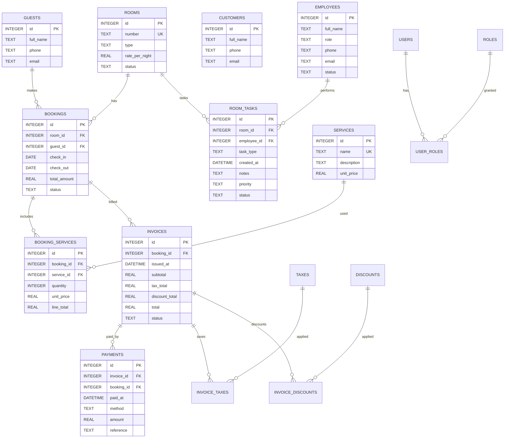

# Hotel Management System (Java + JDBC)

A CLI-based hotel management system built with Java 17, JDBC, and SQLite. It supports operations for rooms, guests, bookings, billing, and more.

## Features
- Create/list rooms and guests
- Create/list bookings with date overlap checks
- Billing system (services, invoices, payments)
- SQLite database with auto-initialized schema

## Tech
- Java 17
- Maven
- JDBC with SQLite JDBC Driver

## Getting Started

### Prerequisites
- Java 17+
- Maven

### Setup SQLite
**No installation required!** SQLite is embedded - the database file will be created automatically.

The database file (`hotel.db`) will be created in the project root directory when you first run the application.

### Configure Application
Edit `src/main/resources/application.properties` (default configuration works out of the box):
```properties
db.url=jdbc:sqlite:hotel.db
db.initSchema=true
```

**Note**: SQLite doesn't require username/password. The database file is stored locally.

### Build and Run
```bash
# Build
mvn clean package

# Run
java -cp 'target/hotel-management-1.0.0.jar:target/lib/*' com.hotel.App
```

The application will automatically create all tables on first run.

### Load Sample Data (Optional)

To populate the database with sample data for testing:

```bash
# Load sample data (keeps existing data)
java -cp 'target/hotel-management-1.0.0.jar:target/lib/*' com.hotel.util.SampleDataLoader

# Clear existing data and load sample data
java -cp 'target/hotel-management-1.0.0.jar:target/lib/*' com.hotel.util.SampleDataLoader --clear
```

See [LOAD_SAMPLE_DATA.md](LOAD_SAMPLE_DATA.md) for details. The sample data includes:
- 20 rooms, 30 guests, 25 bookings
- 15 services, 20 invoices, 30 payments
- 12 employees, 25 room tasks
- **Total: 232 sample records**

## Project Structure
- `src/main/java/com/hotel/App.java` – CLI entrypoint
- `src/main/java/com/hotel/model/*` – domain models
- `src/main/java/com/hotel/dao/*` – DAO interfaces
- `src/main/java/com/hotel/dao/jdbc/*` – JDBC implementations
- `src/main/java/com/hotel/service/HotelService.java` – business logic
- `src/main/java/com/hotel/util/ConnectionManager.java` – JDBC connection + schema init
- `src/main/resources/schema.sql` – tables DDL

## ER Diagram (10 tables)
See `docs/er.md` or preview below:



### Notes
- Now exactly 10 tables: rooms, guests, customers, bookings, services, booking_services, invoices, payments, employees, room_tasks.
- `customers` added; `room_tasks` consolidates housekeeping and maintenance.
- Removed advanced billing (taxes/discounts/rate plans) and auth to simplify.

## Notes
- The application is configured for SQLite. See [SQLITE_SETUP.md](SQLITE_SETUP.md) for setup instructions.
- Database schema is automatically created on first run if `db.initSchema=true`.
- The database file (`hotel.db`) is created in the project root directory.
- All monetary values use `REAL` type in SQLite for floating-point precision.

