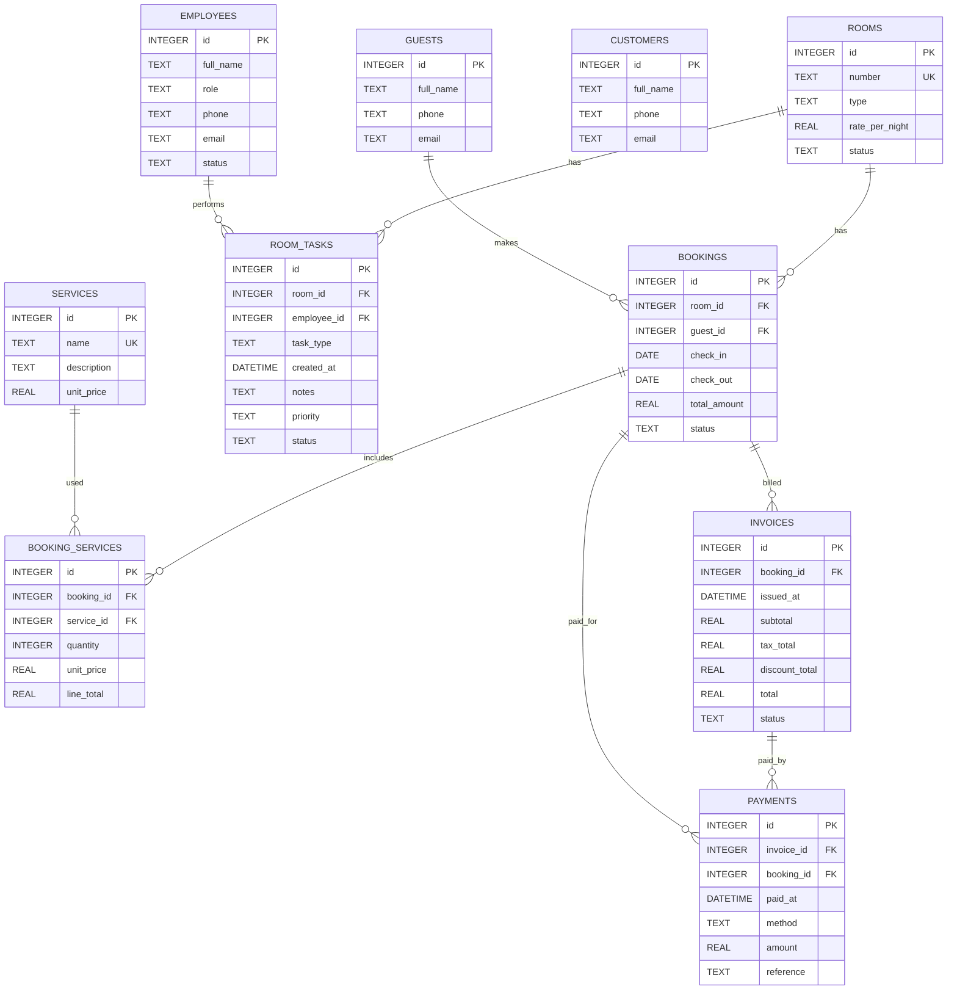

### Entity–Relationship Diagram

Notes:
- **10 tables total**: rooms, guests, customers, bookings, employees, room_tasks, services, booking_services, invoices, payments
- `ROOMS.number` is unique.
- `BOOKINGS.status` in { BOOKED, CHECKED_IN, CHECKED_OUT, CANCELED }.
- `ROOM_TASKS.task_type` in { HOUSEKEEPING, MAINTENANCE }.
- `PAYMENTS` can link to either `INVOICES` or `BOOKINGS` (or both).
- Overlap validation is enforced in application logic.

